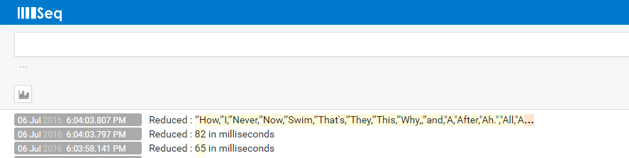

# Word count example with seq integration
In this example I will be going through the famous word count example but I need to have the logs sent to seq.

[Seq](https://getseq.net/) is a popular logging tool in the .net world and it makes it very easy to make use of application logs in a centralised way.

First of all I needed to get my hands dirty with Hadoop and do some real work.
You do not really know about it unless you make mistakes and solve them.
So, other than getting familiar with Haddop I just wanted to add a small piece of .net flavor.
Hadoop MapReduce has its own logging feature and it even supports aggregating logs from all nodes into HDFS.

To summarise, my objective is to get familiar of the MapReduce world and extend it with structured logs by seq.




##Initial Setup
The setup here is simple. We need to grab Horton Works sandbox. It is available for VMware and VirtualBox.
You can get it from : http://hortonworks.com/downloads/#sandbox

After you extract the VM file into your preferred VM tool, you can play with the installed Hadoop copy either using the Shell or via a web console.

The VM OS is CentOS 6.7 and it does not include a GUI so you will need to install any GUI like GNOME or KDE.

##Java version switch
The installed Hadoop copy on this VM is configured with Java 7 (1.7). There is no problem with that other than a small thing.

The java port of Serliog (libray that will allow us to write logs to seq and elsewhere) is written in java 8.
A nice guy has already did the hard work of porting the .net serilog code into java and named it [serilogj](https://github.com/80dB/serilogj).

So, our first task here is to switch hadoop from java 7 (1.7) to java 8(1.8).
I am no java expert so I just tried some googling here and there to make it happen and I do not claim this is reliable but it is enough for our example.

In brief the steps to switch to java 8 are:
1. Install java 8 from Oracle site.
2. Run the following command to select default java runtime : **alternatives --config java**
3. Update the environment variables for JAVA_HOME
   + export JAVA_HOME=**your java 8 folder**
   + export PATH=$JAVA_HOME/bin:$PATH
4. I followed [this link](http://unix.stackexchange.com/questions/110512/uninstall-jdk-rpm-to-reinstall) to uninstall java 7
5. Perform the few steps mentioned in [Horton Works docs](https://docs.hortonworks.com/HDPDocuments/Ambari-2.2.1.1/bk_ambari_reference_guide/content/ch_changing_the_jdk_version_on_an_existing_cluster.html) to switch JDK version of ambari.
6. Restart your VM and try to make sure Ambari is still alive and you can browse and view HDFS folders at least.


##Eclipse and serilogj

Next step is to install Eclipse to be able to write our basic word count sample. Please note that we are using hadoop v2 distribution in case you will be copying word count from pages for v1.
Generally speaking it should work but many package names and JARs are different so you should be prepared.

I am including full source code of the working sample in folder [LogsWithSeq](LogsWithSeq) so this should not be a big deal.

Back to Eclipse, go to the official site and download Luna for example (we do not need high end EE things, the basic java projects will be fine).

 Next head to github and download a zipped copy of [serilogj](https://github.com/80dB/serilogj) repo.
 Extract it into the default workspace folder of Eclipse and create another java project called WordCount into same workspace.

 In the new project **WordCount**, you will need to do the following:
 + Reference JAR files for hadoop
 + Reference the serilog project

For **serilogj** project you will need to:
+ Download a bunch of dependencies from Maven repo (boon-json-0.5.7.jar,boon-reflekt-0.5.7.jar,boon-util-0.5.7.jar)
+ Add them to the project external reference JARs
+ Copy them to some class path visible folder like /usr/lib

As I mentioned before, I am no java geek so the above might not be the best way to do things but it worked for me.

Next grab some source code for Word Count canonical example on hadoop 2 from anywhere and dump it into the WordCount project.

Make sure that all projects compile and try to export both projects as a single JAR and run it in the most basic way as below:

**$ hadoop jar WordCount.jar WordCount.Counter /input-folder /output-folder**

Input and output folders are HDFS folders created using the shell (**hdfs dfs -mkdir**) or using HDFS view on ambari.
Also the input folder should contain any text file with a bunch of words. You can put anything but the classic example is to grab a novel in text format from project gutenberg.


 ```java
 placeholder
 ```