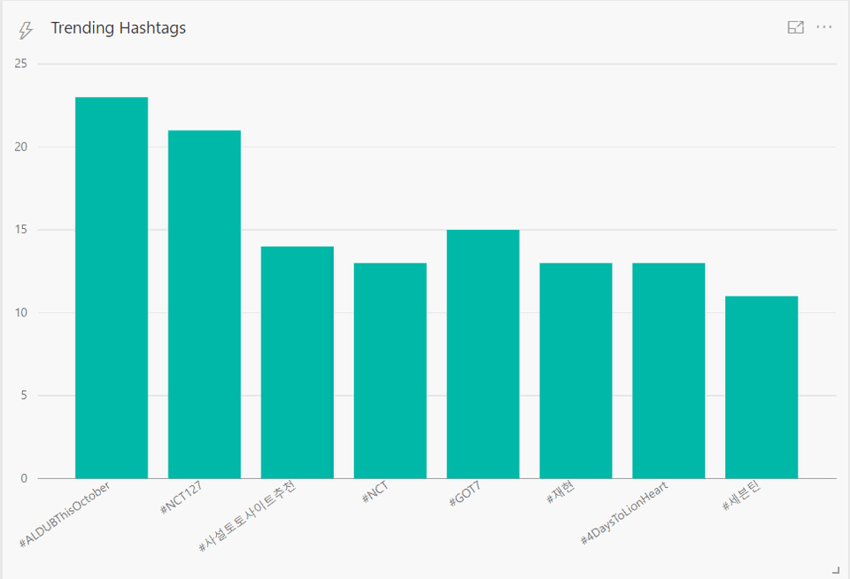

# Spark streaming to Power BI dashboard

## Overview

This example will show how to connect streaming data aggregated using Apache Spark to a Power BI dashboard.
Spark is a general purpose data processing engine and it has specific libraries for machine learning, streaming and graph processing as well.
I will be using Spark Streaming to stream tweets, do some basic aggregation and push the results to Power BI.
So the overall objective is to create some basic **realtime** Power BI dashboard showing trending hashtags in twitter at the moment.
The cool thing is that Power BI REST API has a streaming API feature now that does not need complex OAUTH access token and stuff like that.
It simply works with a shared access key in the URL which makes it pretty easy to use it from any client capable of doing plain HTTP posts.

The final output should be as below (*it refreshes every 10 seconds*):

1. [Preparing Spark Environment](spark-streaming-part1.md)
2. [Word count in Scala](spark-streaming-part2.md)
3. [Streaming trending hashtags to the console](spark-streaming-part3.md)
4. [Configure Power BI Dashboard with a streaming dataset](spark-streaming-part4.md)
5. [Connecting Spark aggregated data to Power BI](spark-streaming-part5.md)

## Other Resources:

* [Spark Overview](http://spark.apache.org/docs/1.6.2/index.html)
* [Pluralsight course - Apache Spark Fundamentals](https://www.pluralsight.com/courses/apache-spark-fundamentals)
* [Building a Real-time IoT Dashboard with Power BI: A Step-by-Step Tutorial](https://powerbi.microsoft.com/en-us/blog/using-power-bi-real-time-dashboards-to-display-iot-sensor-data-a-step-by-step-tutorial/)
* [Book - Learning Spark](http://shop.oreilly.com/product/0636920028512.do)
