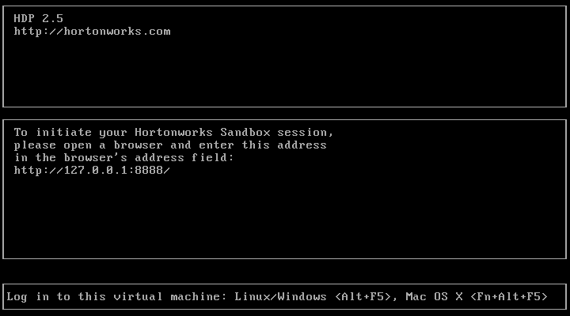
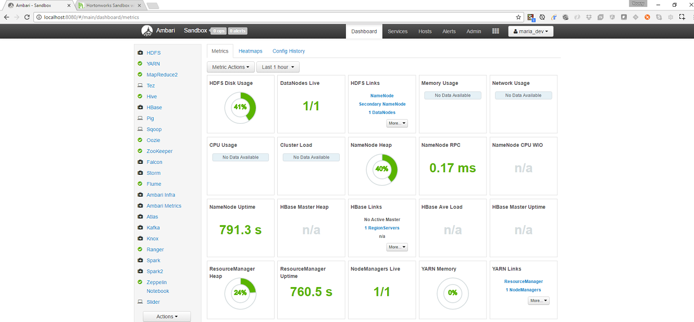
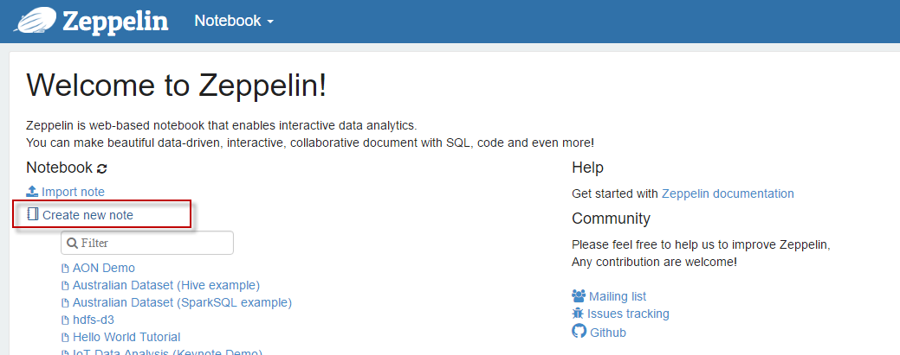
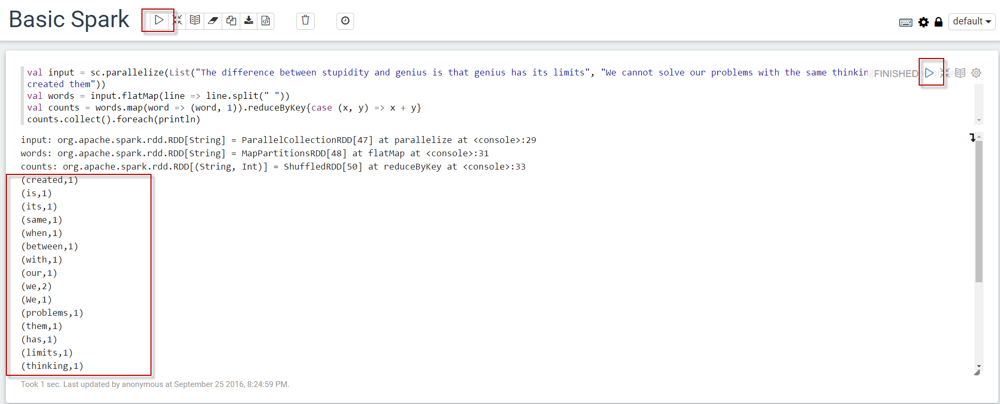

#1. Preparing Spark Environment

[Apache Spark](http://spark.apache.org/docs/1.6.2/index.html) is a fast and general-purpose cluster computing system. 
It provides high-level APIs in Java, Scala, Python and R, and an optimized engine that supports general execution graphs. 
It also supports a rich set of higher-level tools including Spark SQL for SQL and structured data processing, MLlib for machine learning, GraphX for graph processing, and Spark Streaming.

I will be using Spark 1.6.2 although Spark 2.0 has been released and it provides a bunch of improvments but 1.6.2 should be very enough for our scenario.
Spark is a Scala application and can be installed standalone but generally speaking it will be bundled in a Hadoop installation.
I will use Hortonworks Sandbox becuase it is easy to use, contains other bits installed like HDFS/Zeppelin and comes with Ambari to view and monitor the whole cluster. 

##Installing Hortonworks Sandbox

1. Download Hortonworks HDP 2.5 sandbox [Hortonworks Sandbox](https://cran.r-project.org/mirrors.html).
    * Sandbox can be used with VirtualBox/Vmware/Docker.
    * I will use VirtualBox in this demo but you are free to pick another type of virtualization you like.
    * Sandbox is more than 10GB size so prepare for a bit of waiting if you do not have fast connection.
2. Once downloaded, double click the **.ova** file downloaded and follow the VirtualBox wizard to import the VM.
3. The VM will be imported with some default settings but I recommend to tweak the following settings if you have some HW capacity:
    * CPU : verify it has 4 CPUs.
    * Memory : 8GB should be good but you can add more if you are going deep with other stuff like machine learning. 
    * Display : Give it 128MB of video memory as we will be installing a linux Desktop in a second.
4. Start the VM and you should be getting the below:

  

## Verify Hadoop installation

Once the sandbox is started you can try the below links in the browser to make sure it is running as expected:

1. [Sandbox dashboard page](http://localhost:888) will give you access to useful links, documentation and tutorials.
2. [Ambari](http://localhost:8080/#/login) can be used to navigate Hadoop cluster components and do some stuff like upload files to HDFS and start/stop services.
    * You can use user and password maria_dev/maria_dev as a first step although sandbox dashboard page provides documentation for a bunch of other user types.
    * You can also [reset ambari admin password](http://hortonworks.com/hadoop-tutorial/learning-the-ropes-of-the-hortonworks-sandbox/#setup-ambari-admin-password) in case you need to need full control on stuff like hadoop service settings.

    

3. [Zeppelin](http://localhost:9995/#/) is a web-based notebook that enables interactive data analytics. 
    * Click on the above link to open Zeppelin home page.
    * Click on the link **Create new note** to open a new blank notbook where we will be writing some basic Spark program. Provide any name for the new notebook.

    
    
    * In the new notebook write down the below snippt of code which basically does a simple word count for two lines of Albert Einstein quotes.

    ```
    val input = sc.parallelize(List("The difference between stupidity and genius is that genius has its limits", "We cannot solve our problems with the same thinking we used when we created them"))
    val words = input.flatMap(line => line.split(" "))
    val counts = words.map(word => (word, 1)).reduceByKey{case (x, y) => x + y}
    counts.collect().foreach(println)
    ```

    * Click the run button for the current paragraph or the whole notebook and you should get the below meaning Spark works as expected

    

## Install desktop system


## Install Scala IDE


Yay, you are ready to jump into the big data ocean.


## End of Part 1

You now a VM with Spark preinstalled, and ready to get started. Proceed to [Work count in Scala](spark-streaming-part2.md)
