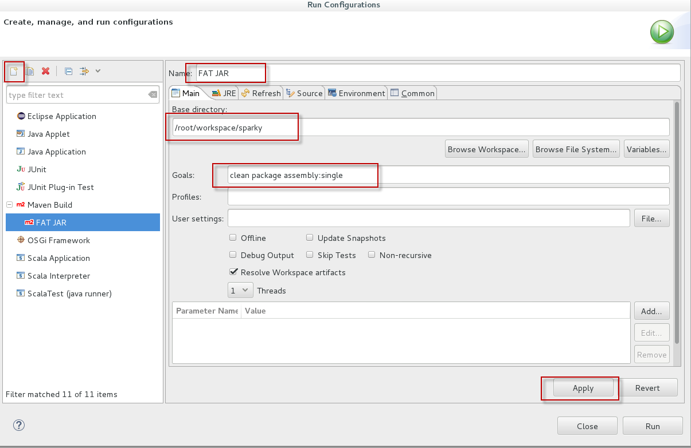

# 2. Word count in Scala

In this part we will implement a scala word count app and run it using *spark-submit* tool.
The source code is found in the below repo but is trimmed from all twitter keys that will come in later parts.

[Source Code](../SparkStreaming)

##Creating Scala Project

1. Open Scala IDE
2. From the menu, select File > New > Project
3. From the project template list, expand Maven group and select *Maven Project*
4. In the next wizard step, tick *Create a simple project*
5. Next fill a group Id and artifact Id for the new project as below

    

6. Click Finish button

##Configure Maven build settings

1. Expand the new project node and double click *pom.xml* file and switch to xml view tab    
2. Add the following before the closing project tag

    ```
    <pluginRepositories>
		<pluginRepository>
			<id>scala-tools.org</id>
			<name>Scala-tools Maven2 Repository</name>
			<url>http://scala-tools.org/repo-releases</url>
		</pluginRepository>
	</pluginRepositories>
    <dependencies>		
        <dependency>
			<groupId>org.apache.spark</groupId>
			<artifactId>spark-core_2.10</artifactId>
			<version>1.6.2</version>
		</dependency>
    </dependencies>

    <build>
		<plugins>
			<!-- mixed scala/java compile -->
			<plugin>
				<groupId>org.scala-tools</groupId>
				<artifactId>maven-scala-plugin</artifactId>
				<version>2.15.2</version>
				<executions>
					<execution>
						<id>compile</id>
						<goals>
							<goal>compile</goal>
						</goals>
						<phase>compile</phase>
					</execution>
					<execution>
						<id>test-compile</id>
						<goals>
							<goal>testCompile</goal>
						</goals>
						<phase>test-compile</phase>
					</execution>
					<execution>
						<phase>process-resources</phase>
						<goals>
							<goal>compile</goal>
						</goals>
					</execution>
				</executions>
			</plugin>
			<plugin>
				<artifactId>maven-compiler-plugin</artifactId>
				<version>3.5.1</version>
				<configuration>
					<source>1.7</source>
					<target>1.7</target>
				</configuration>
			</plugin>
			<plugin>
                <artifactId>maven-assembly-plugin</artifactId>
                <configuration>
                    <archive>
                        <manifest>
                            <mainClass>com.spnotes.spark.NetcatStreamClient</mainClass>
                        </manifest>
                    </archive>
                    <descriptorRefs>
                        <descriptorRef>jar-with-dependencies</descriptorRef>
                    </descriptorRefs>
                </configuration>
            </plugin>
		</plugins>
		<pluginManagement>
			<plugins>
				<!--This plugin's configuration is used to store Eclipse m2e settings 
					only. It has no influence on the Maven build itself. -->
				<plugin>
					<groupId>org.eclipse.m2e</groupId>
					<artifactId>lifecycle-mapping</artifactId>
					<version>1.0.0</version>
					<configuration>
						<lifecycleMappingMetadata>
							<pluginExecutions>
								<pluginExecution>
									<pluginExecutionFilter>
										<groupId>org.scala-tools</groupId>
										<artifactId>
											maven-scala-plugin
										</artifactId>
										<versionRange>
											[2.15.2,)
										</versionRange>
										<goals>
											<goal>compile</goal>
											<goal>testCompile</goal>
										</goals>
									</pluginExecutionFilter>
									<action>
										<execute></execute>
									</action>
								</pluginExecution>
							</pluginExecutions>
						</lifecycleMappingMetadata>
					</configuration>
				</plugin>
			</plugins>
		</pluginManagement>
	</build>
    ```

3. The above huge snippet does the following:
    1. Adds reference to Spark Core dependency
    2. Configures maven plugins to allow building a fat JAR in case we have other JAR dependencies like what we will see later 
4. Save *pom.xml* file.
5. Maven will start to download dependencies and plugins from its repository, this may take a while so you may like to get some coffee.
6. Once done you will get some error that project configuration is not up to date. Just right click this error and select quick fix and then Finish in the next dialog window.

    

7. Right click the project name in package explorer then Configure then **Add Scala nature**
8. Once done we will get some errors as Spark is built with a different version than the one selected for the current project
9. To fix it, right click the project name again then Properties then Scala compiler
10. Configure it as below and click OK and allow Eclipse to do full rebuild
    
11. Next we need to remove Scala Library container from build path. Right click project name then Build Path then configure Build Path.
12. Switch to Libraries tab and select Scala Library Container and then click Remove then OK.

    

## Develop Word Count Example

1. Rename the folder src/main/java to src/main/scala (click the folder and then Shift Alt R). Do the same for src/test/java.
2. Right click the folder src/main/scala and then New > Package. For the package name, it should be a combination of our group Id and artifact Id.

    

3. Right click the new package folder and select New > Scala Object and give it a name **wordcount** as below
   
   
4. Replace the whole file contents with the below snippet.

    ```
    package org.bigdata.sparky

    import org.apache.spark.SparkConf
    import org.apache.spark.SparkContext
    import org.apache.spark.SparkContext._
    
    object wordcount {

        def main(args: Array[String]) {
            val conf = new SparkConf().setAppName("WordCountApp")

            val sc = new SparkContext(conf)
            val input = sc.parallelize(List("The difference between stupidity and genius is that genius has its limits", "We cannot solve our problems with the same thinking we used when we created them"))
            val words = input.flatMap(line => line.split(" "))
            val counts = words.map(word => (word, 1)).reduceByKey{case (x, y) => x + y}
            counts.collect().foreach(println)
        } 

    }   
    ```

5. This is very similar to the small word count app we did in part 1 using Zeppelin notebook with a few differences
    * Added a bunch of import statements to reference Spark packages. Zeppelin notebooks have such things loaded by default.
    * Created a new Spark Context for the current application. Think of it as similar to things like EF DbContext if you are coming from .NET world.
    * Zeppelin has a ready made context to be used directly and it is named **sc** if you peek at part 1 details.
6. Save the new updates to the word count class we have.


## Package & test the application

1. No we will need to package and export a FAT JAR (JAR with all dependencies), copy it to docker container and run it using spark-submit.
   For the time being we have only one dependency which is Spark core and is already installed on target container but next parts will make use of the configurations we will do now as there will be some dependencies and libraries not available on target container.

2. Open *pom.xml* but do not go to XML view, the dependencies tab is our target here
3. Select Spark_Core dependency then properties and change its scope to provided (meaning it is already available on target environment) then click OK

    

4. From the menu, select *Run* then *Run Configurations*
5. From the left pane select Maven build, then from the top toolbar there is a small button called "New launch configuration", click it
6. Fill the new configuration dialog as below. Base directory should point to the folder containing our *sparky* project if you have a different workspace location.

    

7. Click Apply then Run to build the project 
8. The fat jar will be generated in the path */root/workspace/sparky/target/sparky-0.0.1-SNAPSHOT-jar-with-dependencies.jar*, actually Maven build log in the console will have a line telling where to grab the file in case you are using different folders. 
9. Just copy the this file to /root/Documents and rename it to **sparky.jar**. You can use Shell commands or GUI file explorer to do this step.

  
##Run Word Count Example

1. Now we have a JAR file containing a simple Spark application. Next task is to run it using **spark-submit** which is the tool to send Spark jobs to the cluster manager.
2. Unfortunately with Hortonworks HDP 2.5, Hadoop/Spark are not installed on the linux VM OS directly but in a docker container. So, we have to copy our jar file inside that container first.
3. To SSH into the container, open a new browser window and head to : [http://localhost:4200/](http://localhost:4200/), this can be done inside the VM or from the host box.
4. Log in as root/hadoop also but this time you will be asked to change root password.

    
5. Change root password and remember now that we have 2 roots passwords one for the VM OS and one for docker container
6. Create a new directory called jars under root home folder

    `# mkdir jars`
7.  Open a command shell in the VM and type the below command to copy the created JAR inside docker container.

    `# docker cp /root/Documents/sparky.jar  sandbox:/root/jars`

8. Switch back to docker container shell in the browser and type:

    ```
    # cd jars
    # ls
    ```

    You should see sparky.jar file.

9. Type the following in this docker shell:

    ```
        # spark-submit --class org.bigdata.sparky.wordcount sparky.jar
    ```

    The parameters are quite clear, the class containing the program entry point and the jar file for that class.

10. You should get the below in the console. Please note that Spark is very verbose with console messages and application output might be just burried within lots of INFO lines. Log verbosity can be tweaked but it is not our main concern here.

    


Congratulations, you are doing big data now using Spark.

## End of Part 2

We have implemented a Spark word count application in Scala. Proceed to [Streaming trending hashtags to the console](spark-streaming-part3.md)
