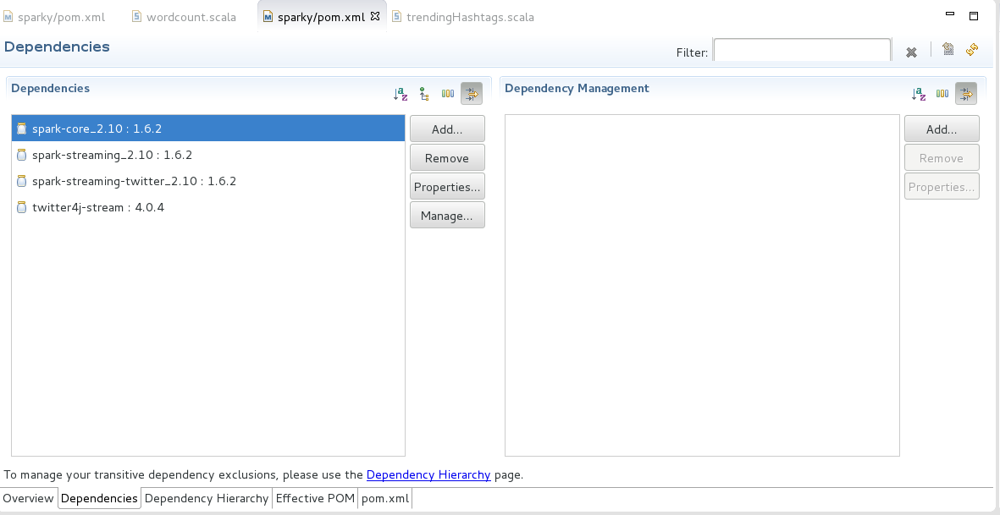
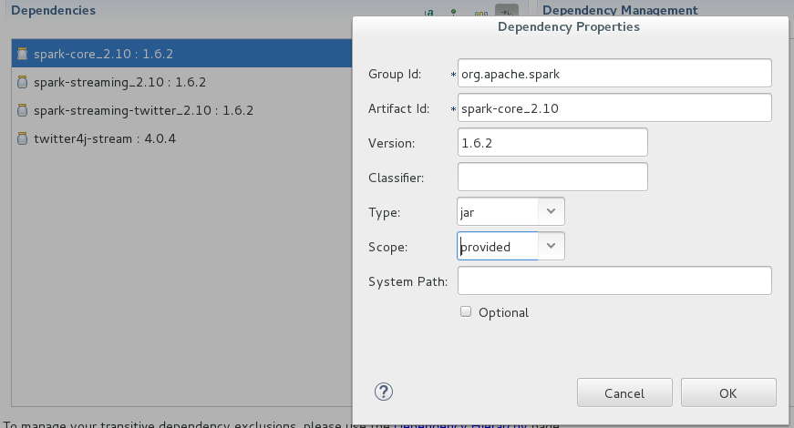
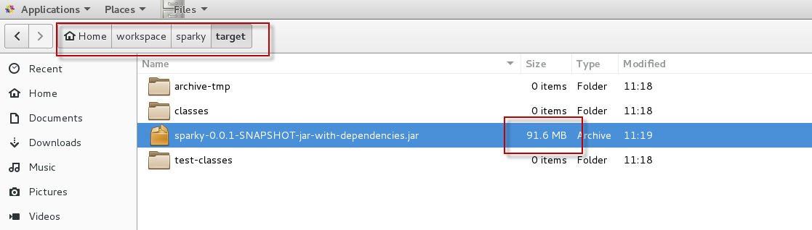

# 3. Streaming trending hashtags to the console

In this part we will extend Spark application we had in [part2](./spark-streaming-part2.md) to collect tweets from Twitter firehose.
There is a library bundled with Spark for streaming tweets from twitter directly as a Spark **DStream** object.

DStream is a special type of an RDD that is designed to work on streamed data for a certain window of time.

So, let us get rolling.

## Twitter app registration

1. We will need to register in [Twitter developer apps](https://apps.twitter.com/)
2. Next we need to create a new app with some name and description and any dummay web site address
3. Once created we will have access to consumer key and secret but we will also need an access token
4. I will list down details to generate access token because it is very straighforward.So in summary we should have:
    * Consumer key
    * Consumer secret
    * Access token
    * Access token secret

## Configure maven dependencies

1. Streaming tweets from Twitter firehose requires a few maven dependencies to be added to the project
    * Spark Streaming
    * Spark Streaming for Twitter
    * Twitter4J
2. Let us open *pom.xml* file and switch to XML view and add the below just before the dependencies closing tag

    ```
        <!-- https://mvnrepository.com/artifact/org.apache.spark/spark-streaming_2.10 -->
		<dependency>
		    <groupId>org.apache.spark</groupId>
		    <artifactId>spark-streaming_2.10</artifactId>
		    <version>1.6.2</version>
		</dependency>
				
		<!-- https://mvnrepository.com/artifact/org.apache.spark/spark-streaming-twitter_2.10 -->
		<dependency>
		    <groupId>org.apache.spark</groupId>
		    <artifactId>spark-streaming-twitter_2.10</artifactId>
		    <version>1.6.2</version>
		</dependency>
		
		
		<!-- https://mvnrepository.com/artifact/org.twitter4j/twitter4j-stream -->
		<dependency>
		    <groupId>org.twitter4j</groupId>
		    <artifactId>twitter4j-stream</artifactId>
		    <version>4.0.4</version>
		</dependency>
    ```
3. Save *pom.xml* and make sure no errors appear in the problems pane.

## A basic intro to Spark Streaming

Spark works with a concept called resilient distributed datasets (RDD). It can be considered something like distributed LINQ if you think C#.
Then regardless of the data size you can do aggregations and calculation over such RDD in a distributed fashion.
For streaming, the same RDD concept still applies but it works on window interval of time (*batch interval*). Each interval of streamed input data will be considered
and RDD (called *DStream*) and same processing can be applied. Another mode of operation for streaming is called windowed operations.
Windowed operations compute results across a longer time period than the batch interval, by combining results from multiple batches.
We can do window operations on a bunch of windows or we can accumulate results from the first window mooving on. For our case we will use the later approach.

The below images from Spark docs shows high level idea of system operation. 


More details about Spark Streaming can be found [here](http://spark.apache.org/docs/latest/streaming-programming-guide.html#overview)

## Implement streaming class

1. Add a new Scala object to the package *org.bigdata.sparky* and name it *trendingHashtags*
2. Add the following import statement after the package import line

    ```
        import org.apache.spark.SparkContext
        import org.apache.spark.SparkContext._
        import org.apache.spark.SparkConf

        import org.apache.spark._
        import org.apache.spark.streaming._
        import org.apache.spark.streaming.twitter._
        import twitter4j.Status
    ```

3. Add the below main method inside the *trendingHashtags* object to configure your twitter app details

    ```
        def main(args: Array[String]): Unit = {
   
            val consumerKey = "YOUR_CONSUMER_KEY"
            val consumerSecret = "YOUR_CONSUMER_SECRET"
            val accessToken= "YOUR_ACCESS_TOKEN"
            val accessTokenSecret = "YOUR_ACCESS_TOKEN_SECRET"
            
            System.setProperty("twitter4j.oauth.consumerKey", consumerKey)
            System.setProperty("twitter4j.oauth.consumerSecret", consumerSecret)
            System.setProperty("twitter4j.oauth.accessToken", accessToken)
            System.setProperty("twitter4j.oauth.accessTokenSecret", accessTokenSecret)

        }

    ```

4. Next we will start to append some snippets to the end of main method to incrementally build our streaming logic
5. Append the below snippet:

    ```
        val batchInterval = 30
        val sc = new SparkContext(new SparkConf().setAppName("TrendingHashTags"))  	
        val ssc = new StreamingContext(sc, Seconds(batchInterval.toInt))
        ssc.checkpoint("hdfs:///tmp/trendingHashtags")
    ```

6. The above defines a batch interval of 30 seconds in which we will collect tweets. Then we need to create a Spark Context. To do streaming, we will need a streaming context built on top of Spark context and configured for a certain batch interval. Then to make streaming resilient to errors spcially with stateful transformations (aggregations over a sliding window of one or more DStream from consequent time periods) we need to define a checkpoint directory which normally will be an HDFS folder. *TMP* folder should be available in HDFS installed with the sandbox so no need to create it.
7. Then we will append the below snippet

    ```
        val tweets = TwitterUtils.createStream(ssc, None)
        val tweetContents = tweets.map{ tweet => tweet.getText()}
        val words = tweetContents.flatMap{content => content.split("""\s+""")}
        val hashTags = words.filter{word => word.startsWith("#")}
    ```

8. The above will create a tweets *DStream* (distributed stream), extract tweet text, falttent it into words and then extract hashtags
9. Let us append the below snippet to main method

    ```
        val hashTagPairs = hashTags.map{hashtag => (hashtag, 1)}
        val tagsWithCounts = hashTagPairs.updateStateByKey(
            (counts: Seq[Int], prevCount: Option[Int]) =>
            prevCount.map{c => c + counts.sum}.orElse{Some(counts.sum)}
        )
    ```
    
10. The above maps hashtags to tuples of the hastag value and the number 1 (its occurence count). 
    Then **updateStateByKey** accumulates over time each hastag and how manytimes it appeared. 
    This is actually the core of this application and it is pretty clear how concise and easy such abstracted API allow us to work with large amounts of streamed data.
    If you think of the old Hadoop word count in java and how complex it was, then you will appreciate the expressiveness of Spark.
    
11. Next we will just filter out any hashtags with counts less than a certain threshold, sort by count decending and print top 10 for example.

    ```
        val minThreshold = 10
        val topHashTags = tagsWithCounts.filter{ case(t, c) =>
        c > minThreshold.toInt
        }
        
        val sortedTopHashTags = topHashTags.transform{ rdd =>
            rdd.sortBy({case(w, c) => c}, false)
        }
        
        val showCount = 10
        sortedTopHashTags.print(showCount.toInt)

    ```

12. The above will print such hashtags to console but in later parts we will publish them to Power BI
13. A streaming application is supposed to run forever unless killed so we need to start the streaming context then stop the main application thread from existing until the stream is terminated.
    This is required as streaming will be executed on another thread(s) and if we do not do *awaitTermination* the program will exit without doing anything.

    ```
        ssc.start()
  	    ssc.awaitTermination()
    ```


## Package & test the application

1. Now we will do similar steps as in part 2, compile and export JAR, copy it to docker container and run it using spark-submit.
2. First let us export the project as a **FAT** JAR. This time right click export will not do the trick as we need to bundle the dependencies.
4. Open *pom.xml* but do not go to XML view, the dependencies tab is our target here

    

5. Select Spark_Core dependency then properties and change its scope to provided (meaning it is already available on target environment) then click OK

    

6. From the menu, select *Run* then *Run Configurations*
7. From the left pane select maven build, then from the top toolbar there is a small button called "New launch configuration", click it
8. Fill the new configuration dialog as below

    

9. Click Apply then Run to build the project 
10. The fat jar will be generated in the path below, just cut it and move it to /root/Documents and rename it to **sparky.jar** 

    

3. Then from a terminal inside the sandbox, we need to copy that JAR to docker container
    ```
        # docker cp /root/Documents/sparky.jar sandbox:/root/jars 
    ```

    Please note that the file operation may fail or does not even overwrite the old small file we had from part2
    To veryify you can use `ls -l --block-size=M` to make sure of file size.
    Worst case you can remove the old file inside docker container and try the above copy again.

4. Next let us SSH into docker container from the browser http://localhost:4200/ using the *root/new password* credential
5. The execute the below:

    ```
        # cd jars
        # spark-submit --class org.bigdata.sparky.trendingHashtags sparky.jar
    ```

6.