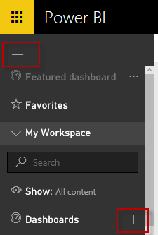
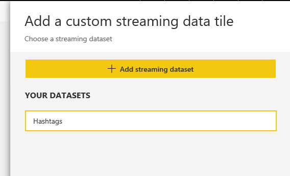

# 4. Configure Power BI Dashboard with a streaming dataset 

In this part we will create a new Power BI dashboard and connect it to a streaming dataset and in the next part we will modify our Spark app to push data to this dashboard.

Power BI has REST API that allowed developers to push data to datasets instead of Power BI service pulling data from a cloud or on-prem data source.
Unfortunately this API authenticates using Azure Active directory tokens and it is hard to do it in a headless manner without lots of logisitics and arrangements with an Azure tenant admin.
Even if you have tenant admin permissions it is still harder than using shared access secrets and it would require also to create dataset and tables first before pushing data.

Fortunately, Power BI has recently released a simpler API for pushing streaming data where we do not need complex auth mechanism and also the schema can be defined using a GUI in advance.
So, Let's see the cool new stuff.

## Sign-up for Power BI

1. For our use case a free Power BI subscripiton will be fine but if you have a paid one it should be good also.
2. Please note that there are limits for pushing data to  a free vs paid subscriptions but we will not be hitting the service hard.
3. Also for Twitter firehose, it has similar limits but this is not a top priority for our POC.
3. So, head up to [Power BI home page](https://powerbi.microsoft.com/en-us/) and get yourself a free subscription.

## Create a new dashboard

1. Sign in to your new Power BI account.
2. Expand the side navigation pane then click the new dashboard button.

    

3. Give it a name like **Trending Hashtags**
4. A new blank dashboard page will open. Click *Add Tile* from the toolbar near the top of screen.
5. Select the tile to be picking from a custom streaming data source and click Next.

    

6. In the next step click to create a new streaming dataset

    

7. For the dataset type select *API* and click Next

    

8. Fill the dataset details as below and click *Create* then *Done*.

    

9. Next, you will have a list of all streaming datasets you have as below.

    

10. Click the *circle* link in the actions column to open the dataset API details.

    

11. So, all we need is to do an HTTP post to that URL (which contains a secret key) and fill HTTP payload with an array of json objects as per the simple format shown above. You will need to record down the POST URL and payload format becuase we will need them in part 5. 

## Configure dashboard tile

1. Now we need to go back to our dashboard and configure how the tile should look like
2. From the left handside navigation pane, click our dashboard name once again.
3. We need to click add new tile again and select custom streaming data but this time we will have one dataset available
4. Select our *Hashtags* dataset and click Next

    

5. Configure the tile as below and click Next. In my final report I switched to column chart not bar chart but this is a minor visual difference.

    

6. In the next step, give the tile a title and click Apply. It will be just an empty tile as below until we push some data.
   We can also resize the tile a bit as it will probably show a handful of hashtags.

    

## End of Part 4

We have Power BI dashboard ready to receive the gems of our smart calculations over streaming data done in Spark 

Proceed to [Connecting Spark aggregated data to Power BI](spark-streaming-part5.md)
