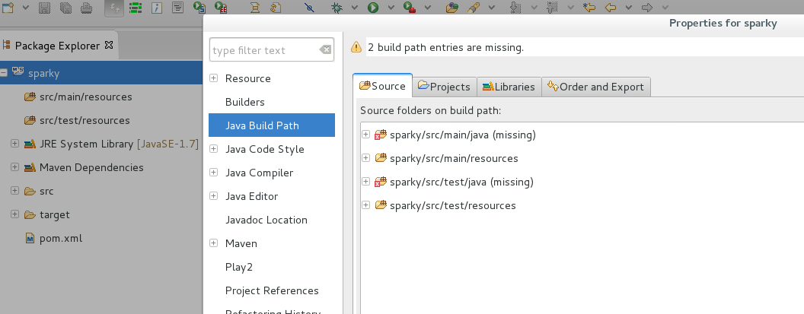
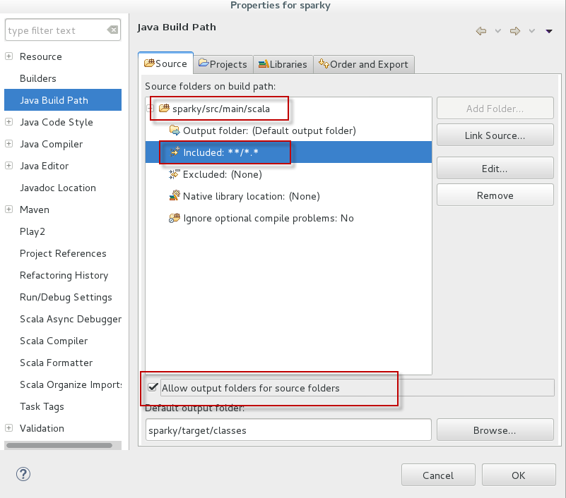
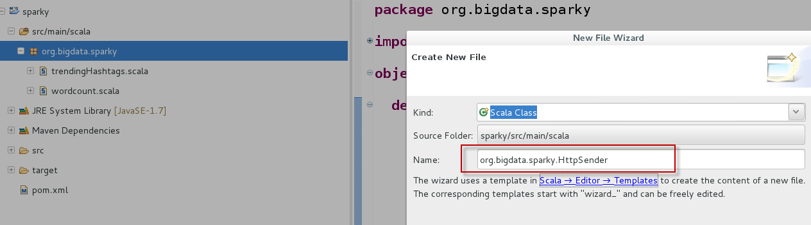
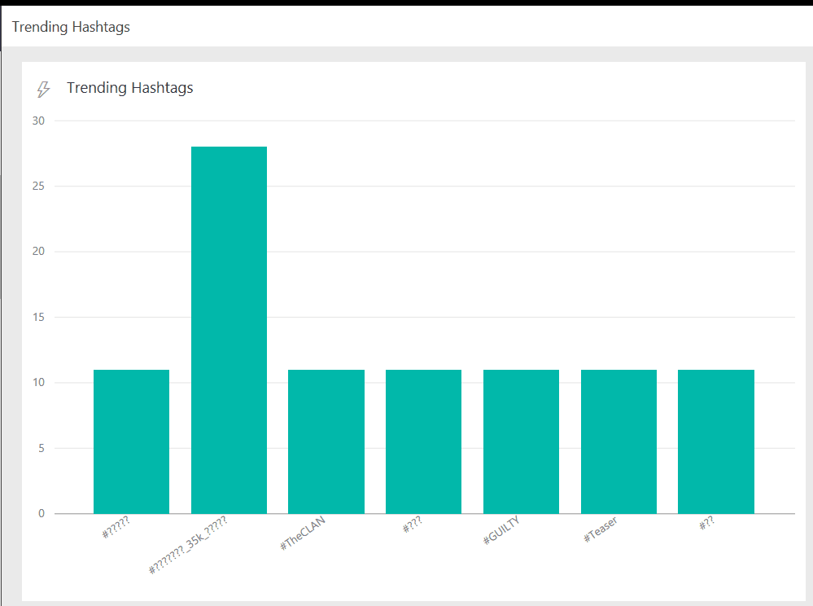

# 5. Connecting Spark aggregated data to Power BI

Wow, we are almost done now and hopefully if we get this part right all the hard work for the last four parts will pay off.

Now we need to extend our Spark application to push hashtags/counts to the API endpoint

## Create a class to talk to Power BI API

1. Let's Start up our sandbox VM and fire up our Scala IDE with Sparky application.
2. First thing we will bring a small dependency to make our life easy with HTTP POSTs.
3. Add the below piece of XML to *pom.xml* file before dependencies closing tag and save the file.

    ```
        <dependency>
            <groupId>org.apache.httpcomponents</groupId>
            <artifactId>httpclient</artifactId>
            <version>4.5.2</version>
        </dependency>
    ```

4. Next we need to add a scala class called *HttpSender* in the same package *org.bigdata.sparky*
5. If for any reason you do not see this package listed in package explorer, you can right click the project name then *Configure Build Path*
    
    

6.  Then remove all the paths listed and add src folder to the build path to get the below

    

7. Next add HttpSender class to our package

    

8. Then replace whole file contents with the below

    ```
    package org.bigdata.sparky

    import org.apache.http.client.methods.HttpPost
    import org.apache.http.entity.StringEntity
    import org.apache.http.impl.client.DefaultHttpClient

    class HttpSender()
    {
        def SendData(tuples: Array[(String,Int)])
        {   
            // convert it to a JSON string
            val items = tuples.map(a => "{\"Hashtag\" :\"" + a._1 + "\",\"Count\":" + a._2 +"}")    
            val json = "[" + items.mkString(",") + "]"    
            // create an HttpPost object - REPLACE WITH YOUR OWN KEY
            val post = new HttpPost("https://api.powerbi.com/beta/............................")  
            // set the Content-type
            post.setHeader("Content-type", "application/json")  
            // add the JSON as a StringEntity
            post.setEntity(new StringEntity(json)) 
            // send the post request
            val response = (new DefaultHttpClient).execute(post) 
            
        }
    }

    ```

9. The above is a very simple helper class with a method that takes an array of tuples and does the following:
    * Map tuples to a string array where each item is a json representation of a single record to be pushed to Power BI
    * Conact all items into a json array string
    * Create an HTTP Post object with the URL we have from Power BI streaming dataset (it is trimmed, grab your own URL)
    * Add an HTTP content-type header and lump the body and fire a POST call to Power BI
10. Save the file and make no errors appear in the console. Scala IDE (Eclipse with Maven) are a bit lousy and they can take a few seconds to refresh and grab the dependencies.


## Push top hashtag statistics

1. Open *trendingHashtags* file.
2. Jsut before the line `ssc.start()` add the below snippet

```
    sortedTopHashTags.foreachRDD((rdd) => {
      val data = rdd.take(showCount)
      val httpSender = new HttpSender()
      httpSender.SendData(data)
    })
```

3. Those few lines are flattening the DStream object into a group of normal RDDs and for each RDD we call rdd.take() which picks top N & converts RDD into an array of underlying objects. Then we take this plain array of tuples and use HttpSender class created above to do the simple HTTP POST.
4. Package and copy the new fat jar to docker container as we saw in previous parts.
5. In docker container, run the same command.

     ```
        # cd jars
        # spark-submit --class org.bigdata.sparky.trendingHashtags sparky.jar
    ```

6. Wait a couple of minutes until the application does its magic.
7. Open Power BI dashboard created before and watch hashtags refreshing in realtime (every 30 seconds to be precise)
8. Please note that some non ASCII hashtags might show as question marks in the dashboard but I am not going to troubleshoot this one now.
9. Also our implementation is just accumulating hashtags from the time it starts till it is killed. A better implementation is to switched to the other mode of windowed operations that works on a a group of windows of one hour for example.
   This way you can find the trending hashtags for the last hour in a sliding window fashion.
10. Moment of truth, drum rolls ......

    


**Side Note** : I modified the batch interval to be 10 seconds to get quicker feedback to display in an animated GIF.

## Conclusion

Spark is a decent tool to do distributed data processing in near realtime (not necessarily streaming) and it can easily be integrated with other platforms like Azure or Power BI. 